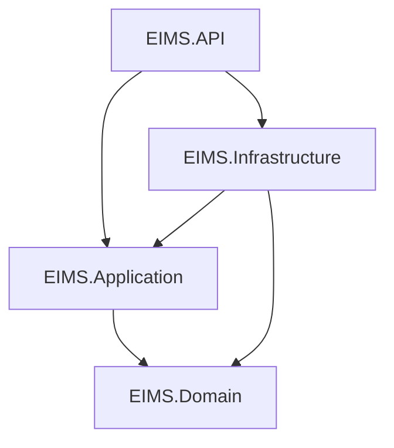

# Enterprise Inventory Management System (EIMS)

> A production-oriented backend application built using modern .NET technologies, Clean Architecture, and Domain-Driven Design principles.

---

## Overview

The **Enterprise Inventory Management System (EIMS)** is a portfolio-quality backend application designed to simulate how inventory management systems are developed in enterprise product companies.

The project focuses on building a maintainable, scalable, and production-ready backend while following modern software engineering practices. Every implementation is approached from a business-first perspective, emphasizing clean architecture, domain modeling, and long-term maintainability rather than simply delivering working code.

---

## Objectives

This project aims to:

- Build a production-quality backend application
- Apply Clean Architecture principles
- Practice Domain-Driven Design (DDD)
- Implement enterprise software engineering practices
- Learn scalable backend design
- Create a portfolio project representative of real-world product development

---

## Technology Stack

| Category | Technology |
|----------|------------|
| Language | C# |
| Framework | .NET 9 |
| API | ASP.NET Core Web API |
| Database | SQL Server |
| ORM | Entity Framework Core |
| Architecture | Clean Architecture |
| Design | Domain-Driven Design (DDD) |
| Validation | FluentValidation *(Planned)* |
| Authentication | JWT *(Planned)* |
| Testing | xUnit *(Planned)* |
| Containerization | Docker *(Planned)* |

---

## Solution Architecture

The solution follows **Clean Architecture**, keeping business logic independent of frameworks and infrastructure.



### Responsibilities

| Project | Responsibility |
|----------|----------------|
| **EIMS.API** | HTTP endpoints, Dependency Injection, Middleware |
| **EIMS.Application** | Use Cases, Commands, Queries, Interfaces, Validation |
| **EIMS.Domain** | Business Rules, Entities, Value Objects, Domain Events |
| **EIMS.Infrastructure** | Persistence, EF Core, Repository Implementations, External Services |

---

## Solution Structure

```
src/
│
├── EIMS.API
├── EIMS.Application
├── EIMS.Domain
└── EIMS.Infrastructure

tests/

docs/
```

---

## Current Progress

### Documentation

- [x] Business Domain Discovery
- [x] Vision Document
- [x] Functional Requirements
- [x] Domain Model
- [x] Event Storming

### Project Setup

- [x] Solution Structure
- [x] Clean Architecture
- [x] Project References
- [x] GitHub Repository

### Development

- [ ] Product Aggregate
- [ ] Product Module
- [ ] Warehouse Module
- [ ] Supplier Module
- [ ] Purchase Orders
- [ ] Inventory Management
- [ ] Authentication
- [ ] Docker Support

---

## Engineering Principles

The project follows the following principles throughout development:

- SOLID Principles
- Clean Code
- DRY
- KISS
- YAGNI
- Dependency Injection
- Domain-Driven Design
- RESTful API Design
- Asynchronous Programming

---

## Development Workflow

Development follows a feature-based Pull Request workflow.

```
main
│
├── feature/pr-001-product-aggregate
├── feature/pr-002-create-product-application
├── feature/pr-003-product-persistence
└── feature/pr-004-create-product-api
```

Each Pull Request focuses on a single responsibility and is reviewed before merging into the `main` branch.

---

## Development Roadmap

### Phase 1 — Foundation

- [x] Business Discovery
- [x] Requirements
- [x] Architecture
- [x] Project Setup

### Phase 2 — Core Domain

- [ ] Product
- [ ] Warehouse
- [ ] Supplier

### Phase 3 — Inventory

- [ ] Purchase Orders
- [ ] Goods Receipt
- [ ] Inventory
- [ ] Stock Reservations

### Phase 4 — Enterprise Features

- [ ] Authentication & Authorization
- [ ] Audit Trail
- [ ] Optimistic Concurrency
- [ ] Global Exception Handling
- [ ] Logging
- [ ] Pagination & Filtering

### Phase 5 — Production Readiness

- [ ] Unit Testing
- [ ] Integration Testing
- [ ] Docker
- [ ] CI/CD

---

## Project Status

🚧 **Active Development**

The application is being developed incrementally using a vertical slice approach while maintaining production-quality architecture, documentation, and engineering practices.

---

## Author

**Bhaskar Soman**

Backend Software Engineer | C# /.NET

---

> This repository is intended to demonstrate enterprise backend software engineering practices rather than simply implementing features. Every architectural decision, implementation, and refactoring is treated as it would be in a production software project.